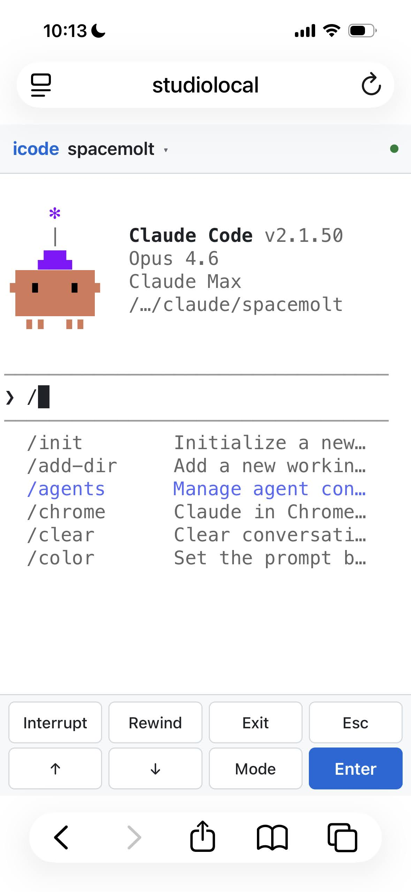

# iCode

Remote-control [Claude Code](https://docs.anthropic.com/en/docs/claude-code) from your iPhone. Runs as a lightweight Node.js server on your Mac; connect from Safari over your local network. You get the full Claude Code terminal experience — colors, ASCII art, permissions, slash commands — on your phone.

<p align="center">
  
</p>

## How It Works

```
iPhone Safari <--WebSocket--> Node.js server <--PTY--> claude CLI
```

The server spawns the real `claude` CLI in a pseudo-terminal (PTY) and streams raw terminal output over WebSocket to [xterm.js](https://xtermjs.org/) in the browser. What you see on your phone is the exact same terminal you'd see on your Mac.

## Features

- **Full terminal experience** — colors, cursor movement, ASCII art, everything renders via xterm.js
- **Permission prompts** — approve/deny tool calls directly in the terminal
- **Project switching** — pick from recent projects or enter a custom path, no server restart needed
- **Shortcut bar** — Interrupt, Rewind, Exit, Esc, arrow keys, Mode (cycle permission modes), and Enter
- **Light & dark theme** — follows your system preference
- **Mobile-first** — designed for iPhone Safari with safe area support and touch-optimized UI

## Requirements

- **Node.js** >= 20
- **Claude Code CLI** installed (`claude` on your PATH)
- Mac and iPhone on the same local network

## Quick Start

```bash
git clone https://github.com/ObekT/iCode.git
cd iCode
npm install
npm run build
npm run dev
```

Then open `http://<your-mac-ip>:3333` in Safari on your iPhone.

To find your Mac's IP:

```bash
ipconfig getifaddr en0
```

## Configuration

| Environment Variable | Default | Description |
|---|---|---|
| `PORT` | `3333` | Server port |
| `ICODE_CWD` | `process.cwd()` | Initial working directory |

## Project Structure

```
src/
  server/
    index.ts    # HTTP server, /api/projects, WebSocket setup
    pty.ts      # Spawns claude via node-pty, WS <-> PTY protocol
  client/
    index.html  # Mobile UI: header, terminal, project picker, shortcut bar
    app.ts      # xterm.js + WebSocket wiring + project picker logic
```

## Tech Stack

- **Server:** Node.js, `ws`, `node-pty`
- **Client:** xterm.js, vanilla TypeScript
- **Build:** esbuild

## WebSocket Protocol

Simple prefix-byte protocol:

| Direction | Format | Description |
|---|---|---|
| Client -> Server | `0<data>` | Terminal input (stdin) |
| Client -> Server | `1<cols>,<rows>` | Resize terminal |
| Client -> Server | `2{"cwd":"..."}` | Switch project / spawn session |
| Server -> Client | raw string | Terminal output (stdout) |
| Server -> Client | `\x01{"type":"..."}` | Control messages (spawned, exited, error, ready) |

## License

MIT
